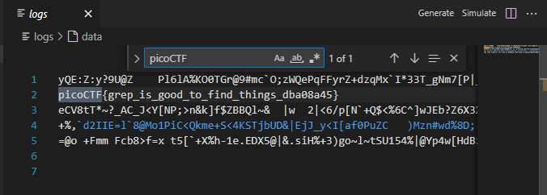

# CTF SOLUTIONS
## CTF-1 (Cryptanalysis)
### 
⭐⭐🚩🚩[ Decrypted Text ](./images/CRLXAJPHEQTKNFDOVIGBMSYUWZ.txt)🚩🚩⭐⭐

* first, i noticed that the alphabet is still the same so I thought of mapping characters ciphers
* i tried Caesar cipher but it didn't work 
* then I thought it might be a monoalphabetic one so I tried using the online tool https://www.dcode.fr/monoalphabetic-substitution to decrypt the text and it successeded in finding it.
* decryption key is 
 ETAOINSHRFLCUMPGJBVKXQYDWZ 

## CTF-2 (Packet Analysis)
### 
⭐⭐🚩🚩picoCTF{p33kab00_1_s33_u_deadbeef} 🚩🚩⭐⭐

* First, i opened the packet file using a packet reader tool (Wiresharks)
* Sorted The Packets According To Their Types Because I Thought That HTTP Requestes Packets Will be More Important
* While Scrolling The Sequence I Noticed That There Was Suddenly A Get Request in the middle of multiple post requests so i checked this packet content
* i found some text that could be possibly the flag

* using cyber chef, i found that it was encrypted using rot-13 encryption and managed to decode it 

## CTF-3 (Image Manipulation)
### 
⭐⭐🚩🚩picoCTF {d72ea4af}🚩🚩⭐⭐

* first i searched for what does it mean for manipulating an image and i found several methods like (adding - xoring - substituting - etc...)
* so i tried all these methods untill i tried adding both images and i got some white image with text in it and it was the flag

 </img>

## CTF-4 (Bit Shifting)
### 
⭐⭐🚩🚩fastctf{a_bit_tricky}🚩🚩⭐⭐

* at first i was confused about what does bit shifting means so i tried two approches
* i tried shifting each byte (character) on its own but it didn't work tho
* so i tried to shift the stream of bits as a whole to the right and left 
* noticing that i don't need more than 7 shifts it was easy to find it manually
by trying to shift the stream of bits with different values and hope to find the flag
* another challenge i faced was that i can't concatenate the whole stream as it will require a large variable to carry it so i made some simple shifting technique you can find in the script

## CTF-5 (Search)
### 
⭐⭐🚩🚩picoCTF{grep_is_good_to_find_things_dba08a45}🚩🚩⭐⭐

* the name of the challenge gave me a way of thinking of the solution
* knowing that there are a fixed signature for the flag i opened the file to search for these signature and find one that corresponds to picoctf

 </img>

## CTF-6 (New Encryption)
### 
⭐⭐🚩🚩 The enemies are making a move. We need to act fast.🚩🚩⭐⭐

* for this challenge i have made analysis for the encryption algorithm and deduced decryption algorithm from it

## CTF-7 (Steganography)
### 
⭐⭐🚩🚩CMPN{Spring2024}🚩🚩⭐⭐

* steganography is hiding a message inside an image using different means
* using this definition and two hints from the challenge statement "HIDING" and "steghide" tool i extracted a text file with the flag inside it.

## CTF-8 (Can You Help Me)
### 
⭐⭐🚩🚩I leave my last message with you, save me🚩🚩⭐⭐

* after hearing the sound file provided i thought it maybe morris code, so i tried an online decoder for this sound file and reached this message
